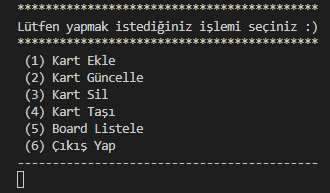

# PatikaAcademy.dev / Başlangıç Seviyesi .Net Core Patikası / PROJE-2 : Console ToDo Uygulaması
Bu proje **PatikaAcademy.dev** platformunun **Başlangıç Seviyesi .Net Core Patikası** eğitimi kapsamında **PROJE-2 : Console ToDo Uygulaması** dersi için yapılmıştır.

| Projenin İçeriği | |
| :-:|:-: |
| 1 | README |
| 1 | .gitignore|
| 1 | LICENSE |
| 1 | Console Application |

## Installation
Öncelikle projeyi klonlayın.
```
git clone https://github.com/vahdetsavci/todo-uygulamasi.git
```

## Usage
Projeyi klonladıktan sonra Visual Studio Code programında açınız.

```
cd todo-uygulamasi
code .
```

Kullanıcı yapmak istediği işlemi seçer ve ilgili adımları takip ederek sonuca ulaşır.




## LICENSE
[MIT](LICENSE)
